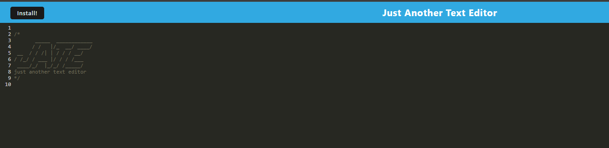

# PWA-text-editor

## Description

This project is a text editor PWA that runs in the browser (single-page). Users can create all sorts of fun notes and the app should also be avaliable offline via PWA magic. Have fun tinkering with this!

Heroku link: 

## Installation

Once cloning the repo, please run an 'npm i' to make sure that all dependencies within the package.json are installed. Then run npm start to launch. The app should then be avaliable via http://localhost:3000/. 

## Usage

Once the app ahs launched, feel free to type whatever you would like within the window. If you are really out of ideas, try this fun dragon ASCII art that I sued to test: 

https://ascii.co.uk/art/dragon 

## Credits

Columbia University Coding Bootcamp

I would like to thank our instructors Ben and Max for being so amazing. <3

## License

MIT License

## How to Contribute

Follow the [Contributor Covenant](https://www.contributor-covenant.org/)!

